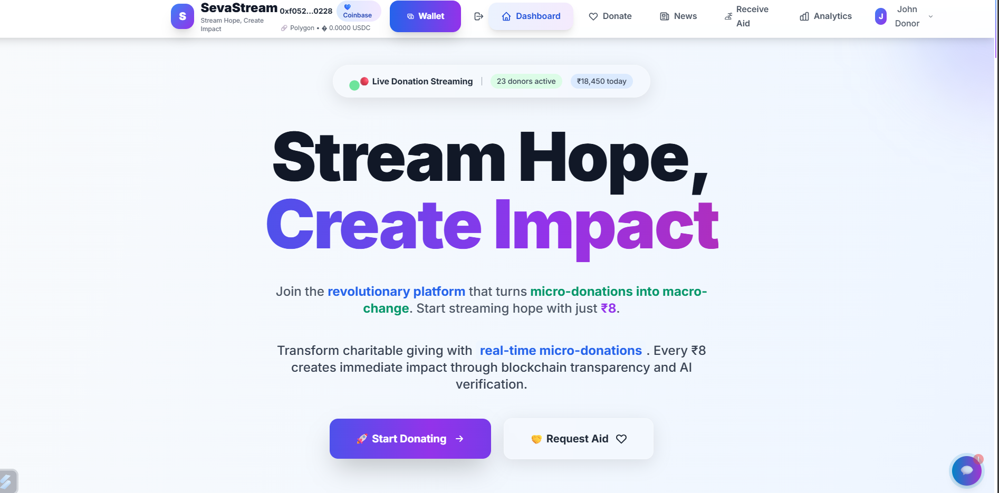
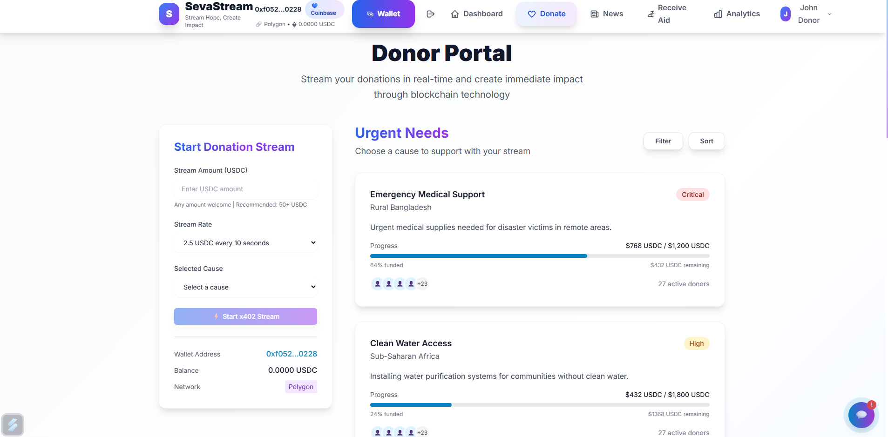

# ⚡ SevaStream - Real-time Donation Streaming Platform


A revolutionary platform enabling micro-donations and real-time aid distribution using blockchain technology and the x402 payment protocol.

## 📸 Screenshots

### 🏠 Main Dashboard

*Real-time donation metrics, active streams counter, and navigation overview*

### 💰 Donation Portal

*USDC donation interface with wallet connection and cause selection*

## ✨ We Have Many More Features

� **Advanced Capabilities:**
- Real-time WebSocket streaming for live updates
- Multi-network blockchain support (Ethereum, Polygon, Arbitrum, Optimism)
- AI-powered impact analysis and campaign optimization
- Geographic distribution tracking across global regions
- Micro-donation pattern analysis with weekend insights
- JWT-based secure authentication system
- x402 protocol integration for seamless payments
- Responsive design optimized for all devices
- Interactive analytics dashboard with live charts
- Automated gas fee optimization
- Smart contract integration for transparent fund distribution
- And many more innovative features to explore! 🌟

## 🎯 Vision
Transform charitable giving from lump-sum donations to continuous, transparent, and traceable streams of support directly to those in need.

## 🏗️ Architecture Overview

### Frontend Layer
- **Donor Dashboard**: React.js + Tailwind CSS for web interface
- **Receiver View**: Real-time status updates and aid tracking
- **Mobile App**: React Native/Flutter for field workers and NGOs

### Backend Layer
- **Core API**: Node.js (Express.js) with x402 middleware
- **AI Services**: FastAPI (Python) for needs detection
- **Real-time Updates**: WebSocket integration

### Payments & Blockchain
- **Micro-payments**: x402 Protocol via Coinbase
- **Blockchain**: Polygon/Base/Celo for low-cost transactions
- **Smart Contracts**: Solidity for automated fund release

### Data & Verification
- **Needs Detection**: Mock AI API (Python/JSON)
- **IoT Integration**: GPS tracking and QR code verification
- **Storage**: IPFS for decentralized record keeping

## 🚀 Getting Started

### 🌐 Live Demo
🔗 **Access the live application**: [http://localhost:3000](http://localhost:3000)

**Demo Credentials:**
- **Donor**: `donor@demo.com` / `demo123`
- **User**: `user@demo.com` / `demo123`

### Prerequisites
- Node.js 18+
- Python 3.9+
- Metamask or Coinbase Wallet
- Git

### Quick Setup
```bash
# Clone and setup
git clone <repository-url>
cd SevaStream

# Install dependencies
npm install
cd backend && npm install
cd ../ai-services && pip install -r requirements.txt

# Start development servers
npm run dev
```

## 📊 Project Structure
```
SevaStream/
├── frontend/              # React.js donor dashboard
├── mobile/               # React Native field worker app
├── backend/              # Node.js API server
├── ai-services/          # Python FastAPI for needs detection
├── smart-contracts/      # Solidity contracts
├── docs/                 # Documentation
└── scripts/              # Deployment and utility scripts
```

## 💡 Key Features

### 🚀 **Real-time USDC Streaming**
Stream micro-payments starting from $0.10 USDC every 10 seconds with x402 protocol integration

### 🔗 **Multi-Network Blockchain Support**
- **Ethereum** - Primary network for large donations
- **Polygon** - Low-cost transactions for micro-donations  
- **Arbitrum** - Fast Layer 2 scaling
- **Optimism** - Optimistic rollup efficiency

### 🤖 **AI-Powered Impact Analysis**
- Automated urgent needs detection
- Weekend campaign optimization
- Geographic distribution insights
- Micro-donation pattern analysis

### 📱 **Modern User Experience**
- 🚀 Rocket-themed wallet connection buttons
- 📊 Real-time analytics dashboard
- 💰 Four donation categories with live tracking
- 🔐 JWT-based secure authentication

### � **Live Impact Metrics**
- **$298,000+ USDC** total donation volume
- **1,247** active donation streams
- **156** supported causes across global regions
- **$0.058 USDC** average gas fees

### 🎯 **Donation Categories**
1. **Emergency Relief Fund** - $5,000 USDC target
2. **Healthcare Support** - $3,500 USDC target  
3. **Community Development** - $4,200 USDC target
4. **Education Support Initiative** - $2,400 USDC target

## 🛠️ Tech Stack
- **Frontend**: React 18, TypeScript, Tailwind CSS, Socket.IO
- **Backend**: Node.js, Express.js, TypeScript, JWT Auth
- **AI Services**: Python FastAPI, Uvicorn
- **Blockchain**: Multi-network (Ethereum, Polygon, Arbitrum, Optimism)
- **Payments**: x402 Protocol, USDC streaming
- **Real-time**: WebSocket connections, live updates
- **Build Tools**: Vite, ESBuild

## 🔌 API Endpoints

### Authentication
```
POST /api/auth/login       # User authentication
POST /api/auth/register    # User registration
GET  /api/auth/verify      # Token verification
```

### Donations
```
GET  /api/donations        # List all donations
POST /api/donations        # Create new donation
GET  /api/donations/:id    # Get donation details
PUT  /api/donations/:id    # Update donation status
```

### Analytics  
```
GET  /api/analytics/overview    # Dashboard metrics
GET  /api/analytics/streams     # Active stream data
GET  /api/analytics/geographic  # Regional distribution
```

### AI Services (Python FastAPI)
```
GET  /ai/needs-detection       # Analyze urgent needs
POST /ai/impact-prediction     # Predict donation impact
GET  /ai/campaign-optimization # Campaign recommendations
```

## 📈 Development Roadmap
1. **Phase 1**: MVP with mock data and basic UI
2. **Phase 2**: x402 integration and smart contracts
3. **Phase 3**: Mobile app and IoT verification
4. **Phase 4**: Advanced AI and scaling

## 🤝 Contributing
We welcome contributions! Please read our contributing guidelines and code of conduct.

## 📄 License
MIT License - see LICENSE file for details.
